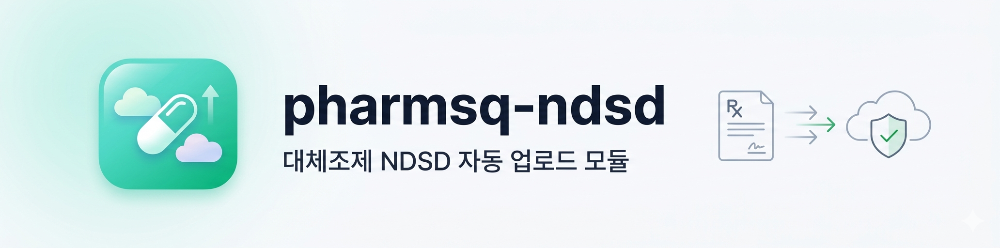

<p align="center">
  
</p>

<h1 align="center">pharmsq-ndsd</h1>

<p align="center">
  약국 관리 프로그램(팜스퀘어 · 온팜 · 유팜 · IT3000 등)이 대체조제 엑셀을<br>
  NDSD(심평원 대체조제 정보시스템)에 자동 업로드하는 <b>오픈소스 Electron 모듈</b>
</p>

<p align="center">
  <a href="https://github.com/guinnessNet/pharmsq-ndsd/releases/latest">
    
  </a>
  <a href="LICENSE">
    
  </a>
  <a href="docs/PROTOCOL.md">
    
  </a>
</p>

---

> **현재 상태** (v0.2.5): 운영 배포 중. NDSD 포털 자동 업로드·사후 검증·자동 업데이트 모두 활성화. 프로토콜 v1.2 ([PROTOCOL.md](docs/PROTOCOL.md)). 변경 이력은 [CHANGELOG.md](CHANGELOG.md).

## 다운로드 · 설치

1. [최신 Release](https://github.com/guinnessNet/pharmsq-ndsd/releases/latest) 에서 `pharmsq-ndsd-Setup.exe` 다운로드
2. 실행 → SmartScreen 경고가 뜨면 **추가 정보** → **실행**
3. 설치 후 트레이에 아이콘이 상주하며, 약국 관리 프로그램에서 NDSD 전송 버튼을 누르면 자동 실행

상세: [`docs/INSTALL.md`](docs/INSTALL.md)

## 개요

약사법·국민건강보험법에 따라 약국이 대체조제를 수행한 경우 심평원 NDSD 포털에 사후 통보해야 합니다. 이 모듈은:

1. PharmSquare(또는 호환 시스템)로부터 Deep Link(`openpharm://`)를 수신
2. 서버에서 대체조제 행 데이터(JSON)를 조회
3. NDSD 공식 13컬럼 엑셀로 변환
4. NPKI 인증서로 NDSD 포털에 자동 로그인 후 업로드
5. 업로드 직후 "대체조제 통보 내역 조회"로 등재 여부를 사후 검증
6. 결과(접수번호·사후 검증 요약)를 서버로 콜백 전송

## 기술 스택

- **Electron** (최신 stable) + **TypeScript** (strict)
- **React 18** (renderer)
- **electron-forge** + webpack (번들러)
- **ExcelJS** (엑셀 생성)
- **Vitest** (유닛 테스트)

## 개발 실행

```bash
# 의존성 설치
npm install

# 앱 실행
npm start

# MOCK 모드 (NDSD 접속 없이 전체 플로우 테스트)
NDSD_MOCK=1 npm start
# 또는
npm run start:mock
```

## 테스트

```bash
npm test
```

ExcelJS 기반 xlsx 생성 유닛테스트가 실행됩니다.

## Mock 모드

환경변수 `NDSD_MOCK=1` 또는 `--mock` CLI 플래그를 설정하면 실제 NDSD 포털 접속 없이 즉시 성공 결과를 반환합니다. 개발·스테이징 환경에서 전체 플로우를 검증할 때 사용하세요.

## 빌드

```bash
npm run make
```

`out/` 폴더에 플랫폼별 설치 파일이 생성됩니다.

## 디렉터리 구조

```
src/
├─ main/
│  ├─ index.ts         # Electron main 진입점
│  ├─ window.ts        # BrowserWindow 생성/복원
│  ├─ tray.ts          # 트레이 아이콘·컨텍스트 메뉴
│  ├─ deeplink.ts      # openpharm:// 파싱·검증
│  ├─ payload.ts       # GET /payload 호출
│  ├─ callback.ts      # POST /callback 전송
│  ├─ manualUpload.ts  # 수동 엑셀 업로드 경로
│  ├─ notify.ts        # OS 알림
│  ├─ preload.ts       # contextBridge (window.ndsdUploader)
│  ├─ ipc.ts           # IPC 채널·타입
│  ├─ jobs/            # 잡 실행·큐·HTTP/file/none 콜백 디스패처·사후 검증 스케줄러
│  ├─ excel/           # 13컬럼 xlsx 생성 + 단위 테스트
│  ├─ automation/      # 비공개 @pharmsq/ndsd-automation 리졸버 (실제 로직은 비공개 패키지)
│  ├─ cert/            # NPKI 스캔·저장·safeStorage 암복호화
│  ├─ certModal/       # 인증서 선택 모달 라이프사이클
│  ├─ verify/          # 포털 통보 내역 대조 엔진
│  ├─ history/         # 업로드 이력 CRUD
│  ├─ settings/        # 설정 저장소
│  ├─ log/             # 로그 버퍼·파일 롤링
│  └─ update/          # electron-updater 기반 자동 업데이트 + 버전 가드
├─ renderer/           # React 18 UI
└─ shared/             # payload/callback 타입 (공개 계약)
```

## 공개 계약

서버와 모듈 간의 payload/callback API 계약은 [`docs/PROTOCOL.md`](docs/PROTOCOL.md)를 참고하세요. 다른 약국 시스템도 이 계약을 구현하면 이 모듈을 재사용할 수 있습니다.

## 트레이 상주 / 설치 후 사용

0.2 버전부터 앱은 **트레이 상주형**으로 동작합니다.

- Windows 시작 시 자동 실행되며, 트레이 아이콘이 상시 떠 있습니다.
- PharmSquare 에서 NDSD 전송 버튼을 누르면 Deep Link(`openpharm://`)로 업로드 창이 자동 오픈됩니다.
- 트레이 아이콘을 우클릭하면 **수동 엑셀 업로드 · 업로드 이력 · 설정**에 접근할 수 있습니다.
- 창을 닫아도 앱은 트레이에서 계속 실행됩니다. 완전 종료하려면 트레이 메뉴의 **종료**를 누르세요.
- 업로드가 실패하면 트레이 아이콘이 빨간 뱃지로 변하고 OS 알림이 뜹니다. **이력** 탭에서 상세 오류와 스크린샷을 확인할 수 있습니다.

### 인증서·비밀번호 설정

설정 탭에서 NPKI 인증서 순번을 선택하고 비밀번호를 입력해두면 업로드 시 자동 로그인됩니다.

- 비밀번호는 **Electron safeStorage (Windows DPAPI)** 로 암호화되어 이 PC 에만 저장됩니다. 다른 PC 로 복사해도 복호화되지 않습니다.
- 보안상 저장된 비밀번호는 **화면에 다시 표시되지 않으며, 재입력을 통해서만 갱신**할 수 있습니다.

## 설치 시 SmartScreen 경고

현재 릴리즈는 **코드 서명이 없습니다** (조직 인증서 도입 전). 최초 설치 시 Windows SmartScreen 이 경고를 표시할 수 있습니다.

> ⚠ "PC 보호" 화면이 뜨면 **추가 정보** → **실행**을 눌러주세요.

오픈소스 프로젝트이지만 배포물 변조를 막기 위해 다음 보호 장치를 사용합니다:

- **Electron Fuses**: `OnlyLoadAppFromAsar` + `EnableEmbeddedAsarIntegrityValidation` — 설치 후 asar 번들을 임의로 교체하면 실행되지 않습니다.
- **자동 업데이트**: GitHub Releases 기반 공식 채널에서만 업데이트를 받습니다. `deploy/manifest.json` 의 `minVersion` 으로 구버전 업로드를 차단할 수 있습니다.

코드를 수정해서 사용하려면 직접 빌드해야 하며, 수정된 빌드물은 공식 업데이트 경로와 격리됩니다.

## 보안

취약점 신고: **kjh@maipharm.com** ([SECURITY.md](SECURITY.md) 참조)

## 라이선스

[Apache-2.0](LICENSE)
